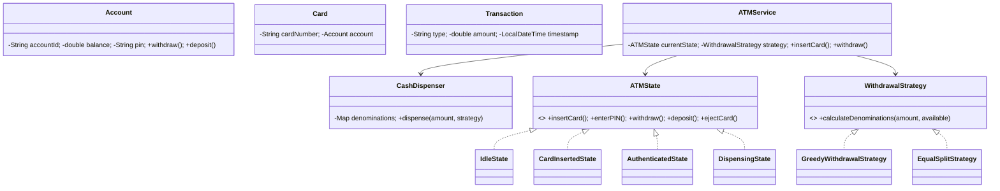

# 🏧 ATM System — Low Level Design

A complete ATM system implementing **State Pattern** and **Strategy Pattern** with account management, card authentication, cash withdrawal with denomination strategies, and transaction history.

## Design Patterns Used

| Pattern | Purpose | Classes |
|---------|---------|---------|
| **State** | ATM state machine (Idle → CardInserted → Authenticated → Dispensing) | `ATMState`, `IdleState`, `CardInsertedState`, `AuthenticatedState`, `DispensingState` |
| **Strategy** | Pluggable withdrawal denomination algorithm (Greedy, Equal-split) | `WithdrawalStrategy`, `GreedyWithdrawalStrategy`, `EqualSplitStrategy` |

## 📂 Package Structure

```
ATMSystem/
├── model/           # Domain entities
│   ├── Account.java           — AccountId, balance, PIN, deposit/withdraw
│   ├── Card.java              — Card number, linked account
│   ├── Transaction.java       — Transaction record with type, amount, timestamp
│   └── CashDispenser.java     — Denomination inventory management
├── state/           # State Pattern
│   ├── ATMState.java          — Interface
│   ├── IdleState.java         — Waiting for card
│   ├── CardInsertedState.java — Waiting for PIN
│   ├── AuthenticatedState.java — Ready for operations
│   └── DispensingState.java   — Dispensing cash
├── strategy/        # Strategy Pattern
│   ├── WithdrawalStrategy.java
│   ├── GreedyWithdrawalStrategy.java — Largest denomination first
│   └── EqualSplitStrategy.java — Even distribution across denominations
├── service/         # Business logic
│   └── ATMService.java        — Insert card, authenticate, withdraw, deposit
└── ATMMain.java               — Demo scenarios
```

## 🔄 How State Pattern Works

1. ATM starts in **`IdleState`** — only `insertCard()` is valid
2. Card inserted → transitions to **`CardInsertedState`** — only `enterPIN()` is valid
3. PIN verified → transitions to **`AuthenticatedState`** — withdraw, deposit, check balance
4. Withdrawal initiated → transitions to **`DispensingState`** → dispenses → back to Authenticated
5. Eject card → back to **`IdleState`**
6. Invalid operations in wrong state are rejected with error messages

## 📐 UML Class Diagram



## 🚀 How to Run

```bash
cd /Users/srnitish/workplace/LLD2
javac -d out src/ATMSystem/model/*.java src/ATMSystem/state/*.java src/ATMSystem/strategy/*.java src/ATMSystem/service/*.java src/ATMSystem/ATMMain.java
cd out && java ATMSystem.ATMMain
```

## 📋 Demo Scenarios

1. **Full ATM flow** — Insert card → PIN → check balance → withdraw → eject
2. **Greedy denomination** — Withdraw using largest-first algorithm
3. **Strategy swap** — Switch to equal-split denomination at runtime
4. **Invalid PIN** — Authentication failure handling
5. **Insufficient funds** — Withdraw more than balance
6. **Wrong state** — Try to withdraw without inserting card
