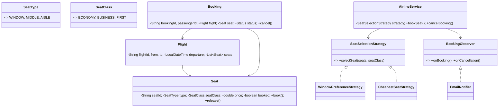

# ✈️ Airline Reservation System — Low Level Design

A complete airline reservation system implementing **Strategy Pattern** and **Observer Pattern** with flight management, seat classes, pluggable seat selection algorithms, booking lifecycle, and email notifications.

## Design Patterns Used

| Pattern | Purpose | Classes |
|---------|---------|---------|
| **Strategy** | Pluggable seat selection (Window-preference, Cheapest seat) | `SeatSelectionStrategy`, `WindowPreferenceStrategy`, `CheapestSeatStrategy` |
| **Observer** | Notify on booking confirmation and cancellation | `BookingObserver`, `EmailNotifier` |

## 📂 Package Structure

```
AirlineReservation/
├── model/           # Domain entities
│   ├── SeatType.java          — WINDOW, MIDDLE, AISLE
│   ├── SeatClass.java         — ECONOMY, BUSINESS, FIRST
│   ├── Seat.java              — SeatId, type, class, price, booked status (thread-safe)
│   ├── Flight.java            — FlightId, from/to, departure, seats list
│   └── Booking.java           — BookingId, passenger, flight, seat, status
├── strategy/        # Strategy Pattern
│   ├── SeatSelectionStrategy.java
│   ├── WindowPreferenceStrategy.java — Prefers window, falls back to any available
│   └── CheapestSeatStrategy.java    — Picks lowest-priced seat in class
├── observer/        # Observer Pattern
│   ├── BookingObserver.java
│   └── EmailNotifier.java
├── service/         # Business logic
│   └── AirlineService.java    — Book, cancel, show availability, strategy swap
└── AirlineMain.java           — Demo scenarios
```

## 🔄 How Strategy Pattern Works

1. **`AirlineService`** holds a `SeatSelectionStrategy` for picking the optimal seat
2. **`WindowPreferenceStrategy`** filters for window seats first, falls back to any available in the class
3. **`CheapestSeatStrategy`** sorts available seats by price, picks the minimum
4. Strategy swap at runtime enables different booking preferences (comfort vs budget)
5. Seat booking is **thread-safe** with `synchronized` on individual seats

## 📐 UML Class Diagram



## 🚀 How to Run

```bash
cd /Users/srnitish/workplace/LLD2
javac -d out src/AirlineReservation/model/*.java src/AirlineReservation/strategy/*.java src/AirlineReservation/observer/*.java src/AirlineReservation/service/*.java src/AirlineReservation/AirlineMain.java
cd out && java AirlineReservation.AirlineMain
```

## 📋 Demo Scenarios

1. **Window preference** — Book economy and first class with window-preference strategy
2. **Cheapest seat** — Switch to cheapest-seat strategy at runtime
3. **Cancel & rebook** — Cancel a booking, seat released, rebooked by another passenger
4. **Full class** — All economy seats booked, availability shows 1 remaining (first class)
