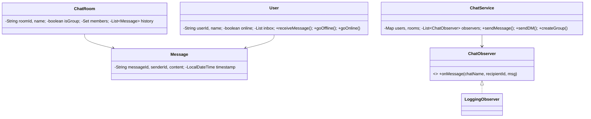

# 💬 Chat Application — Low Level Design

A complete chat application implementing **Observer Pattern** with group chats, private DMs, online/offline status, message delivery, chat history, and logging.

## Design Patterns Used

| Pattern | Purpose | Classes |
|---------|---------|---------|
| **Observer** | Notify on message delivery and log all message events | `ChatObserver`, `LoggingObserver` |

## 📂 Package Structure

```
ChatApplication/
├── model/           # Domain entities
│   ├── Message.java           — MessageId, senderId, content, timestamp
│   ├── User.java              — UserId, name, online status, inbox
│   └── ChatRoom.java          — RoomId, name, isGroup, members set, message history
├── observer/        # Observer Pattern
│   ├── ChatObserver.java      — Interface: onMessage(chatName, recipientId, msg)
│   └── LoggingObserver.java   — Logs all message routing
├── service/         # Business logic
│   └── ChatService.java       — Register, createGroup, sendMessage, sendDM, showHistory
└── ChatMain.java              — Demo scenarios
```

## 🔄 How Observer Pattern Works

1. **`ChatService`** maintains a list of `ChatObserver` instances
2. When a message is sent to a room, the service iterates over **all members except the sender**
3. Online recipients receive the message in their inbox immediately
4. Offline recipients trigger a "message queued" log (offline storage simulation)
5. All observers are notified for every recipient — enables logging, analytics, push notifications
6. DMs auto-create a chat room keyed by sorted user-pair IDs (deduplication)

## 📐 UML Class Diagram



## 🚀 How to Run

```bash
cd /Users/srnitish/workplace/LLD2
javac -d out src/ChatApplication/model/*.java src/ChatApplication/observer/*.java src/ChatApplication/service/*.java src/ChatApplication/ChatMain.java
cd out && java ChatApplication.ChatMain
```

## 📋 Demo Scenarios

1. **Group chat** — 3 users in "LLD Study Group", messages delivered to all members
2. **Private DM** — Alice and Bob exchange direct messages
3. **Offline user** — Diana goes offline, messages queued instead of delivered
4. **Chat history** — View full message history of a chat room
