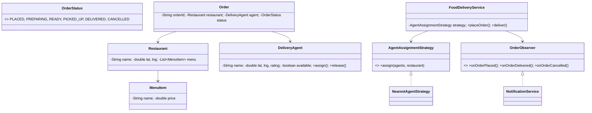

# 🍕 Food Delivery System — Low Level Design

A complete food delivery system implementing **Strategy Pattern** and **Observer Pattern** with restaurant management, menu ordering, delivery agent assignment, order lifecycle, and real-time notifications.

## Design Patterns Used

| Pattern | Purpose | Classes |
|---------|---------|---------|
| **Strategy** | Pluggable delivery agent assignment (Nearest agent) | `AgentAssignmentStrategy`, `NearestAgentStrategy` |
| **Observer** | Notify on order placed, delivered, and cancelled | `OrderObserver`, `NotificationService` |

## 📂 Package Structure

```
FoodDelivery/
├── model/           # Domain entities
│   ├── OrderStatus.java       — PLACED, PREPARING, READY, PICKED_UP, DELIVERED, CANCELLED
│   ├── MenuItem.java          — Name, price
│   ├── Restaurant.java        — Name, location, menu items
│   ├── DeliveryAgent.java     — Name, location, rating, availability
│   └── Order.java             — Customer, restaurant, items, agent, status, total
├── strategy/        # Strategy Pattern
│   ├── AgentAssignmentStrategy.java
│   └── NearestAgentStrategy.java
├── observer/        # Observer Pattern
│   ├── OrderObserver.java
│   └── NotificationService.java
├── service/         # Business logic
│   └── FoodDeliveryService.java — Place order, prepare, pickup, deliver, cancel
└── FoodDeliveryMain.java      — Demo scenarios
```

## 🔄 How Strategy Pattern Works

1. **`FoodDeliveryService`** holds an `AgentAssignmentStrategy` to assign delivery agents
2. **`NearestAgentStrategy`** calculates distance from each available agent to the restaurant, picks closest
3. Agent is atomically assigned (thread-safe `assign()` with `synchronized`)
4. Strategy can be extended with `HighestRatedAgentStrategy`, `LeastBusyStrategy`, etc.

## 📐 UML Class Diagram



## 🚀 How to Run

```bash
cd /Users/srnitish/workplace/LLD2
javac -d out src/FoodDelivery/model/*.java src/FoodDelivery/strategy/*.java src/FoodDelivery/observer/*.java src/FoodDelivery/service/*.java src/FoodDelivery/FoodDeliveryMain.java
cd out && java FoodDelivery.FoodDeliveryMain
```

## 📋 Demo Scenarios

1. **Full delivery lifecycle** — Place → Prepare → Pickup → Deliver with rating
2. **Cancel order** — Order cancelled, agent released
3. **All agents busy** — No available agents, order rejected
