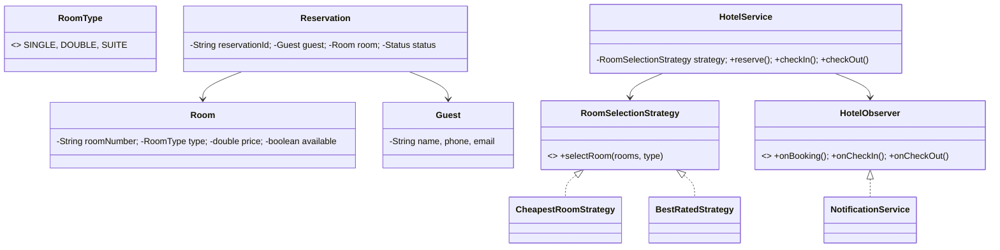

# 🏨 Hotel Management System — Low Level Design

A complete hotel management system implementing **Strategy Pattern** and **Observer Pattern** with room management, guest reservations, check-in/check-out, pluggable room selection algorithms, and booking notifications.

## Design Patterns Used

| Pattern | Purpose | Classes |
|---------|---------|---------|
| **Strategy** | Pluggable room selection (Cheapest room, Best-rated room) | `RoomSelectionStrategy`, `CheapestRoomStrategy`, `BestRatedStrategy` |
| **Observer** | Notify on booking, check-in, and check-out events | `HotelObserver`, `NotificationService` |

## 📂 Package Structure

```
HotelManagement/
├── model/           # Domain entities
│   ├── RoomType.java          — SINGLE, DOUBLE, SUITE
│   ├── Room.java              — Room number, type, price, available status
│   ├── Guest.java             — Name, phone, email
│   └── Reservation.java       — Guest, room, dates, status
├── strategy/        # Strategy Pattern
│   ├── RoomSelectionStrategy.java
│   ├── CheapestRoomStrategy.java
│   └── BestRatedStrategy.java
├── observer/        # Observer Pattern
│   ├── HotelObserver.java
│   └── NotificationService.java
├── service/         # Business logic
│   └── HotelService.java      — Reserve, check-in, check-out, cancel
└── HotelMain.java             — Demo scenarios
```

## 🔄 How Strategy Pattern Works

1. **`HotelService`** holds a `RoomSelectionStrategy` to pick the best room from available ones
2. **`CheapestRoomStrategy`** sorts available rooms by price ascending, picks the cheapest
3. **`BestRatedStrategy`** sorts by rating descending, picks the highest-rated room
4. Strategy is swapped at runtime for different booking preferences

## 📐 UML Class Diagram



## 🚀 How to Run

```bash
cd /Users/srnitish/workplace/LLD2
javac -d out src/HotelManagement/model/*.java src/HotelManagement/strategy/*.java src/HotelManagement/observer/*.java src/HotelManagement/service/*.java src/HotelManagement/HotelMain.java
cd out && java HotelManagement.HotelMain
```

## 📋 Demo Scenarios

1. **Reserve room** — Guest reserves cheapest available room
2. **Strategy swap** — Switch to best-rated strategy at runtime
3. **Check-in/Check-out** — Full guest lifecycle
4. **Cancel reservation** — Cancel and release room back to pool
5. **No availability** — Attempt to book when room type is full
