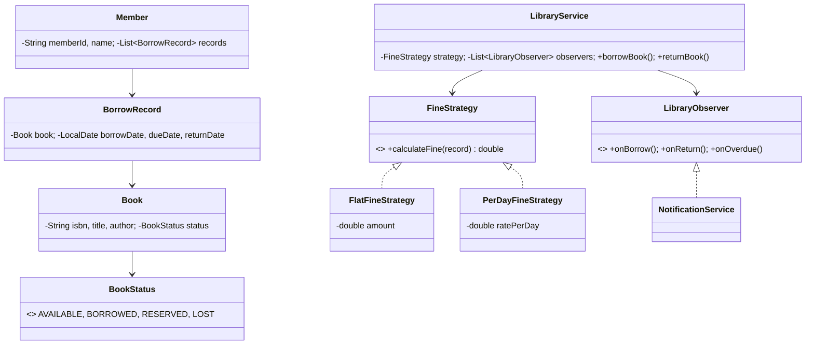

# 📚 Library Management System — Low Level Design

A complete library system implementing **State Pattern**, **Observer Pattern**, and **Strategy Pattern** with book lifecycle management, member borrowing/returning, fine calculation, and real-time notifications.

## Design Patterns Used

| Pattern | Purpose | Classes |
|---------|---------|---------|
| **State** | Book lifecycle transitions (Available → Borrowed → Reserved → Lost) | `BookStatus` enum governs allowed transitions |
| **Observer** | Notify members and librarians on borrow/return/overdue events | `LibraryObserver`, `NotificationService` |
| **Strategy** | Pluggable fine calculation (Flat rate, Per-day) | `FineStrategy`, `FlatFineStrategy`, `PerDayFineStrategy` |

## 📂 Package Structure

```
LibraryManagement/
├── model/           # Domain entities
│   ├── BookStatus.java        — AVAILABLE, BORROWED, RESERVED, LOST
│   ├── Book.java              — ISBN, title, author, status
│   ├── Member.java            — Member with borrowed books list
│   └── BorrowRecord.java      — Tracks borrow date, due date, return date
├── strategy/        # Strategy Pattern
│   ├── FineStrategy.java      — Interface
│   ├── FlatFineStrategy.java  — Fixed fine amount
│   └── PerDayFineStrategy.java — Fine per day overdue
├── observer/        # Observer Pattern
│   ├── LibraryObserver.java   — Interface
│   └── NotificationService.java — Logs borrow/return/overdue events
├── service/         # Business logic
│   └── LibraryService.java    — Borrow, return, reserve, search, fine calc
└── LibraryMain.java           — Demo scenarios
```

## 🔄 How State Pattern Works

1. Each `Book` has a `BookStatus` (AVAILABLE, BORROWED, RESERVED, LOST)
2. **`LibraryService.borrowBook()`** checks status is AVAILABLE → transitions to BORROWED
3. **`LibraryService.returnBook()`** checks status is BORROWED → transitions to AVAILABLE, calculates fine if overdue
4. **`LibraryService.reserveBook()`** transitions AVAILABLE → RESERVED
5. Invalid transitions (e.g., borrow an already borrowed book) are rejected with error messages

## 📐 UML Class Diagram



## 🚀 How to Run

```bash
cd /Users/srnitish/workplace/LLD2
javac -d out src/LibraryManagement/model/*.java src/LibraryManagement/strategy/*.java src/LibraryManagement/observer/*.java src/LibraryManagement/service/*.java src/LibraryManagement/LibraryMain.java
cd out && java LibraryManagement.LibraryMain
```

## 📋 Demo Scenarios

1. **Borrow books** — Member borrows available books, status changes to BORROWED
2. **Return with fine** — Overdue return triggers fine calculation via strategy
3. **Strategy swap** — Switch from flat fine to per-day fine at runtime
4. **Reserve book** — Reserve an available book for later pickup
5. **Invalid operations** — Attempt to borrow already-borrowed book, return unreturned book
