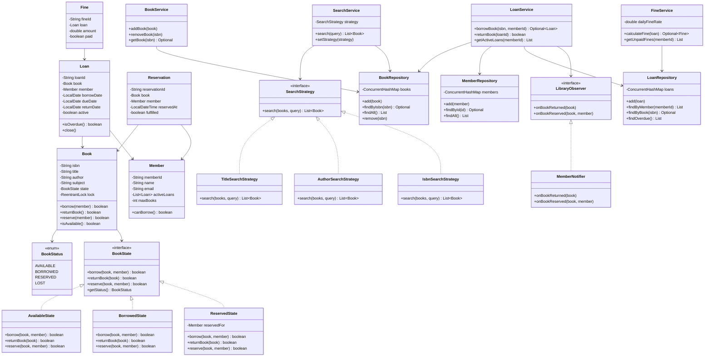

# 📚 Library Management System — Low Level Design

A library management system implementing **State Pattern**, **Strategy Pattern**, **Observer Pattern**, and **Repository Pattern** with SOLID principles, clean OOP design, and **full thread-safety**.

## Problem Statement

Design a library management system that supports:
- Managing books (add, search, borrow, return)
- Member registration and management
- Book lending/returning with due dates
- Fine calculation for overdue books
- Search by title, author, ISBN, or subject
- Reservation system when a book is unavailable
- Notification on book availability

## Design Patterns Used

| Pattern | Purpose | Classes |
|---------|---------|---------|
| **State** | Book transitions: AVAILABLE → BORROWED → RESERVED → LOST | `BookState`, `AvailableState`, `BorrowedState`, `ReservedState` |
| **Strategy** | Pluggable search algorithms (by title, author, ISBN) | `SearchStrategy`, `TitleSearchStrategy`, `AuthorSearchStrategy`, `IsbnSearchStrategy` |
| **Observer** | Notify members when reserved books become available | `LibraryObserver`, `MemberNotifier` |
| **Repository** | Data access abstraction for books, members, loans | `BookRepository`, `MemberRepository`, `LoanRepository` |

## SOLID Principles

| Principle | How Applied |
|-----------|-------------|
| **Single Responsibility** | `LoanService` handles loans, `FineService` calculates fines, `SearchService` handles search |
| **Open/Closed** | New search strategies or book states added without modifying existing code |
| **Liskov Substitution** | All `SearchStrategy` implementations are interchangeable |
| **Interface Segregation** | Focused interfaces: `SearchStrategy`, `LibraryObserver` |
| **Dependency Inversion** | Services depend on repository interfaces, not concrete storage |

## 🔐 Thread-Safety

| Mechanism | Where | Why |
|-----------|-------|-----|
| **`ReentrantLock` (per book)** | `Book.lock` | Fine-grained locking for borrow/return operations |
| **`ConcurrentHashMap`** | All repositories | Thread-safe storage for concurrent access |
| **`CopyOnWriteArrayList`** | Observer list | Safe iteration during concurrent notifications |
| **`synchronized`** | `LoanService.borrowBook()` | Atomic check-and-borrow to prevent double-lending |

## 📂 Package Structure

```
LibraryManagement/
├── model/
│   ├── Book.java
│   ├── BookStatus.java
│   ├── Member.java
│   ├── Loan.java
│   ├── Fine.java
│   └── Reservation.java
├── state/
│   ├── BookState.java
│   ├── AvailableState.java
│   ├── BorrowedState.java
│   └── ReservedState.java
├── strategy/
│   ├── SearchStrategy.java
│   ├── TitleSearchStrategy.java
│   ├── AuthorSearchStrategy.java
│   └── IsbnSearchStrategy.java
├── observer/
│   ├── LibraryObserver.java
│   └── MemberNotifier.java
├── repository/
│   ├── BookRepository.java
│   ├── MemberRepository.java
│   └── LoanRepository.java
├── service/
│   ├── BookService.java
│   ├── LoanService.java
│   ├── SearchService.java
│   └── FineService.java
└── LibraryMain.java
```

## 📐 UML Class Diagram



## 🚀 How to Run

```bash
cd /path/to/LLD2
javac -d out src/LibraryManagement/model/*.java src/LibraryManagement/state/*.java src/LibraryManagement/strategy/*.java src/LibraryManagement/observer/*.java src/LibraryManagement/repository/*.java src/LibraryManagement/service/*.java src/LibraryManagement/LibraryMain.java
cd out && java LibraryManagement.LibraryMain
```

## 📋 Demo Scenarios

1. **Add books** — register multiple books in the library
2. **Register members** — create members with borrow limits
3. **Borrow books** — member borrows a book, state transitions to BORROWED
4. **Search** — search by title, author, ISBN with runtime strategy swap
5. **Return with fine** — return overdue book, fine calculated
6. **Reserve** — reserve a borrowed book, get notified when returned
7. **Concurrent** — multiple members try to borrow the same book simultaneously
