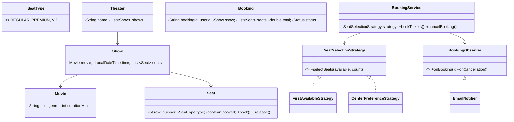

# 🎬 Movie Ticket Booking System — Low Level Design

A complete movie ticket booking system implementing **Strategy Pattern** and **Observer Pattern** with theater management, show scheduling, seat selection algorithms, and booking notifications.

## Design Patterns Used

| Pattern | Purpose | Classes |
|---------|---------|---------|
| **Strategy** | Pluggable seat selection (First-Available, Center-Preference) | `SeatSelectionStrategy`, `FirstAvailableStrategy`, `CenterPreferenceStrategy` |
| **Observer** | Notify on booking confirmation and cancellation | `BookingObserver`, `EmailNotifier` |

## 📂 Package Structure

```
MovieTicketBooking/
├── model/           # Domain entities
│   ├── SeatType.java          — REGULAR, PREMIUM, VIP
│   ├── Seat.java              — Seat with row, number, type, booked status
│   ├── Movie.java             — Title, genre, duration
│   ├── Show.java              — Movie + time + list of seats
│   ├── Theater.java           — Name + list of shows
│   └── Booking.java           — User, show, seats, total, status
├── strategy/        # Strategy Pattern
│   ├── SeatSelectionStrategy.java
│   ├── FirstAvailableStrategy.java
│   └── CenterPreferenceStrategy.java
├── observer/        # Observer Pattern
│   ├── BookingObserver.java
│   └── EmailNotifier.java
├── service/         # Business logic
│   └── BookingService.java    — Book, cancel, strategy swap
└── MovieBookingMain.java      — Demo scenarios
```

## 🔄 How Strategy Pattern Works

1. **`BookingService`** holds a `SeatSelectionStrategy` that selects seats from available pool
2. **`FirstAvailableStrategy`** picks the first N available seats sequentially
3. **`CenterPreferenceStrategy`** sorts available seats by distance from center, picks closest
4. Strategy is swappable at runtime via `setStrategy()`

## 📐 UML Class Diagram



## 🚀 How to Run

```bash
cd /Users/srnitish/workplace/LLD2
javac -d out src/MovieTicketBooking/model/*.java src/MovieTicketBooking/strategy/*.java src/MovieTicketBooking/observer/*.java src/MovieTicketBooking/service/*.java src/MovieTicketBooking/MovieBookingMain.java
cd out && java MovieTicketBooking.MovieBookingMain
```

## 📋 Demo Scenarios

1. **Book tickets** — First-available seat selection for regular booking
2. **Center preference** — Switch strategy to center-preference for premium experience
3. **Cancel booking** — Cancel and release seats back to available pool
4. **Sold out** — Attempt to book when insufficient seats available
