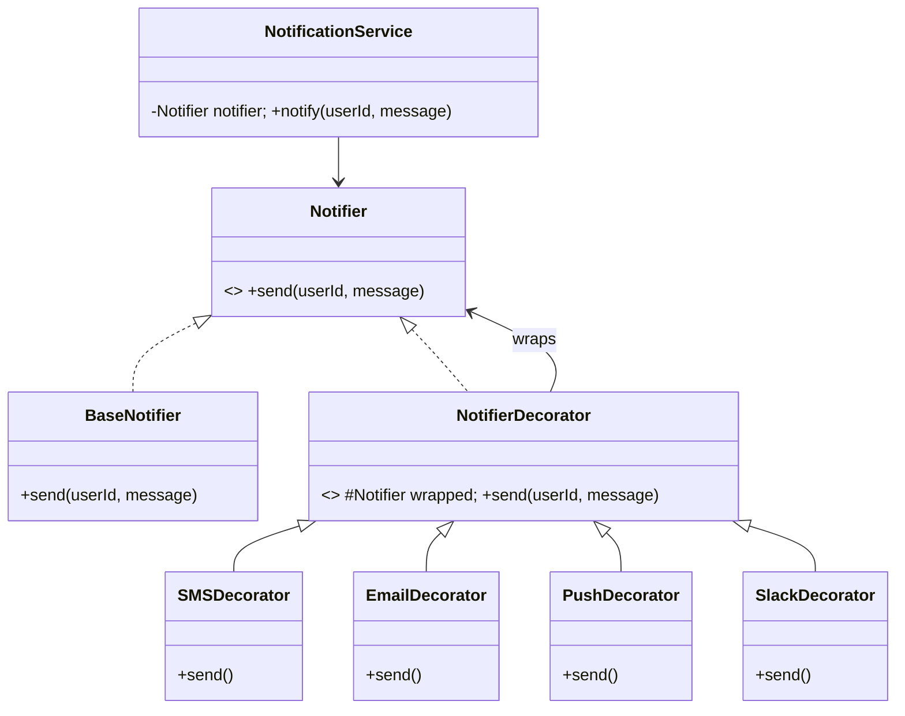

# 🔔 Notification System — Low Level Design

A complete notification system implementing **Decorator Pattern** with stackable notification channels (SMS, Email, Push, Slack) that can be composed in any combination at runtime.

## Design Patterns Used

| Pattern | Purpose | Classes |
|---------|---------|---------|
| **Decorator** | Stack notification channels dynamically — each decorator wraps another notifier and adds a channel | `NotifierDecorator`, `SMSDecorator`, `EmailDecorator`, `PushDecorator`, `SlackDecorator` |

## 📂 Package Structure

```
NotificationSystem/
├── model/           # Base notifier
│   ├── Notifier.java          — Interface: send(userId, message)
│   └── BaseNotifier.java      — Concrete base: logs the notification
├── decorator/       # Decorator Pattern
│   ├── NotifierDecorator.java — Abstract decorator wrapping a Notifier
│   ├── SMSDecorator.java      — Adds SMS channel
│   ├── EmailDecorator.java    — Adds Email channel
│   ├── PushDecorator.java     — Adds Push notification channel
│   └── SlackDecorator.java    — Adds Slack channel
├── service/         # Business logic
│   └── NotificationService.java — Sends notification via composed notifier
└── NotificationMain.java      — Demo scenarios
```

## 🔄 How Decorator Pattern Works

1. **`Notifier`** is the base interface with `send(userId, message)`
2. **`BaseNotifier`** provides the concrete base — logs the notification
3. **`NotifierDecorator`** is an abstract class that wraps any `Notifier` and delegates to it
4. Each concrete decorator (SMS, Email, Push, Slack) calls `super.send()` first, then adds its own channel
5. Decorators are **composable** — wrap any combination:

```java
// SMS only
Notifier sms = new SMSDecorator(new BaseNotifier());

// Email + Push
Notifier emailPush = new PushDecorator(new EmailDecorator(new BaseNotifier()));

// All channels
Notifier all = new SlackDecorator(new PushDecorator(new EmailDecorator(new SMSDecorator(new BaseNotifier()))));
```

## 📐 UML Class Diagram



## 🚀 How to Run

```bash
cd /Users/srnitish/workplace/LLD2
javac -d out src/NotificationSystem/model/*.java src/NotificationSystem/decorator/*.java src/NotificationSystem/service/*.java src/NotificationSystem/NotificationMain.java
cd out && java NotificationSystem.NotificationMain
```

## 📋 Demo Scenarios

1. **SMS only** — Single decorator wrapping base notifier
2. **Email + Push** — Two decorators stacked
3. **All channels** — SMS + Email + Push + Slack — full decorator chain
4. **Base only** — Just logging, no external channels
