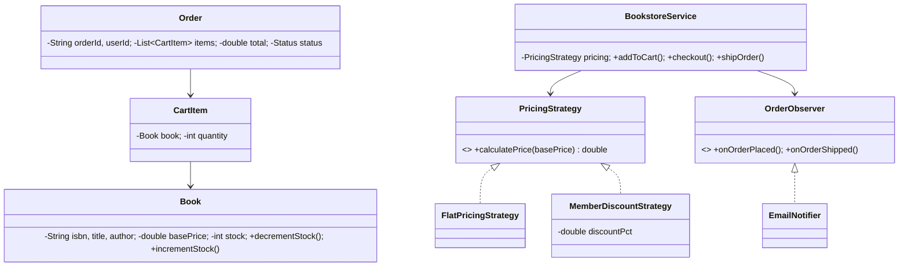

# 📚 Online Bookstore — Low Level Design

A complete online bookstore implementing **Strategy Pattern** and **Observer Pattern** with book catalog, shopping cart, pluggable pricing strategies, inventory management, order lifecycle, and email notifications.

## Design Patterns Used

| Pattern | Purpose | Classes |
|---------|---------|---------|
| **Strategy** | Pluggable pricing calculation (Flat pricing, Member discount) | `PricingStrategy`, `FlatPricingStrategy`, `MemberDiscountStrategy` |
| **Observer** | Notify on order placement and shipping | `OrderObserver`, `EmailNotifier` |

## 📂 Package Structure

```
OnlineBookstore/
├── model/           # Domain entities
│   ├── Book.java              — ISBN, title, author, basePrice, stock (thread-safe)
│   ├── CartItem.java          — Book + quantity
│   └── Order.java             — OrderId, userId, items, total, status
├── strategy/        # Strategy Pattern
│   ├── PricingStrategy.java   — Interface: calculatePrice(basePrice)
│   ├── FlatPricingStrategy.java — Returns base price as-is
│   └── MemberDiscountStrategy.java — Applies configurable percentage discount
├── observer/        # Observer Pattern
│   ├── OrderObserver.java     — Interface: onOrderPlaced(), onOrderShipped()
│   └── EmailNotifier.java
├── service/         # Business logic
│   └── BookstoreService.java  — Add to cart, checkout, ship, show catalog
└── BookstoreMain.java         — Demo scenarios
```

## 🔄 How Strategy Pattern Works

1. **`BookstoreService`** holds a `PricingStrategy` applied during checkout
2. **`FlatPricingStrategy`** returns the base price unchanged (regular customers)
3. **`MemberDiscountStrategy`** applies a configurable percentage off (e.g., 20% for premium members)
4. During checkout, each item's price is calculated via the strategy, multiplied by quantity, and summed
5. Inventory is decremented atomically with `synchronized` stock management

## 📐 UML Class Diagram



## 🚀 How to Run

```bash
cd /Users/srnitish/workplace/LLD2
javac -d out src/OnlineBookstore/model/*.java src/OnlineBookstore/strategy/*.java src/OnlineBookstore/observer/*.java src/OnlineBookstore/service/*.java src/OnlineBookstore/BookstoreMain.java
cd out && java OnlineBookstore.BookstoreMain
```

## 📋 Demo Scenarios

1. **Regular checkout** — Alice buys 2 books at full price ($139.97)
2. **Member discount** — Bob gets 20% off as premium member ($67.98)
3. **Ship order** — Order shipped with email notification
4. **Out of stock** — Charlie tries to buy 5 copies when only 2 remain
