# 🅿️ Parking Lot System — Low Level Design

A multi-level parking lot system implementing **Strategy Pattern**, **Factory Pattern**, and **Observer Pattern** with clean OOP design, SOLID principles, and **full thread-safety**.

## Problem Statement

Design a multi-level parking lot system that supports:
- Multiple vehicle types (Motorcycle, Car, Truck)
- Multiple spot sizes (Compact, Regular, Large)
- Automatic spot assignment based on vehicle type
- Ticket generation on entry, payment on exit
- Real-time availability tracking
- Multiple entry/exit points (concurrent access)

## Design Patterns Used

| Pattern | Purpose | Classes |
|---------|---------|---------|
| **Strategy** | Pluggable spot selection algorithm (Nearest to Entrance, First Available) | `ParkingStrategy`, `NearestToEntranceStrategy`, `FirstAvailableStrategy` |
| **Factory** | Create vehicles and spots without exposing creation logic | `VehicleFactory`, `ParkingSpotFactory` |
| **Observer** | Notify displays/systems when lot availability changes | `ParkingLotObserver`, `DisplayBoard`, `AvailabilityTracker` |
| **Singleton** | Single ParkingLot instance per system | `ParkingLot` (thread-safe double-checked locking) |

## SOLID Principles

| Principle | How Applied |
|-----------|-------------|
| **Single Responsibility** | Each class has one job: `Vehicle` models a vehicle, `ParkingSpot` models a spot, `TicketService` handles tickets, `PaymentService` handles payments |
| **Open/Closed** | New vehicle types or parking strategies can be added without modifying existing code — just implement the interface |
| **Liskov Substitution** | Any `Vehicle` subclass can be used wherever `Vehicle` is expected; same for `ParkingSpot` |
| **Interface Segregation** | `ParkingStrategy` and `ParkingLotObserver` are focused interfaces with single methods |
| **Dependency Inversion** | `ParkingService` depends on `ParkingStrategy` interface, not concrete strategy implementations |

## 🔐 Thread-Safety

| Mechanism | Where | Why |
|-----------|-------|-----|
| **`ReentrantLock` (per floor)** | `ParkingFloor.lock` | Fine-grained locking — different floors can park/unpark concurrently |
| **`ConcurrentHashMap`** | `ParkingLot.activeTickets` | Thread-safe ticket storage for concurrent entry/exit |
| **`AtomicInteger`** | `ParkingFloor.availableSpots` | Lock-free availability counter |
| **`volatile`** | `ParkingLot.instance` | Safe singleton publication across threads |
| **`synchronized`** | `ParkingLot.getInstance()` | Double-checked locking for singleton |
| **`ReadWriteLock`** | `AvailabilityTracker` | Many readers (check availability), few writers (spot changes) |

## 📂 Package Structure

```
ParkingLot/
├── model/
│   ├── Vehicle.java              # Abstract vehicle
│   ├── VehicleType.java          # Enum: MOTORCYCLE, CAR, TRUCK
│   ├── Car.java
│   ├── Motorcycle.java
│   ├── Truck.java
│   ├── ParkingSpot.java          # Abstract spot
│   ├── SpotType.java             # Enum: COMPACT, REGULAR, LARGE
│   ├── CompactSpot.java
│   ├── RegularSpot.java
│   ├── LargeSpot.java
│   ├── ParkingFloor.java         # Floor with spots + per-floor lock
│   ├── Ticket.java               # Entry ticket
│   └── Payment.java              # Payment record
├── factory/
│   ├── VehicleFactory.java
│   └── ParkingSpotFactory.java
├── strategy/
│   ├── ParkingStrategy.java      # Interface
│   ├── NearestToEntranceStrategy.java
│   └── FirstAvailableStrategy.java
├── observer/
│   ├── ParkingLotObserver.java   # Interface
│   ├── DisplayBoard.java
│   └── AvailabilityTracker.java
├── service/
│   ├── ParkingService.java       # Core park/unpark logic
│   ├── TicketService.java        # Issue/validate tickets
│   └── PaymentService.java       # Calculate & process payments
├── ParkingLot.java               # Singleton: floors, entry/exit points
└── ParkingLotMain.java           # Demo with concurrent scenarios
```

## 📐 UML Class Diagram

```mermaid
classDiagram
    direction TB

    class VehicleType {
        <<enum>>
        MOTORCYCLE
        CAR
        TRUCK
    }

    class SpotType {
        <<enum>>
        COMPACT
        REGULAR
        LARGE
    }

    class Vehicle {
        <<abstract>>
        -String licensePlate
        -VehicleType type
        +getLicensePlate() String
        +getType() VehicleType
    }

    class Car {
        +Car(licensePlate)
    }
    class Motorcycle {
        +Motorcycle(licensePlate)
    }
    class Truck {
        +Truck(licensePlate)
    }

    Vehicle <|-- Car
    Vehicle <|-- Motorcycle
    Vehicle <|-- Truck
    Vehicle --> VehicleType

    class ParkingSpot {
        <<abstract>>
        -String spotId
        -SpotType type
        -Vehicle currentVehicle
        -boolean available
        -int floorNumber
        -int distanceFromEntrance
        +park(vehicle) boolean
        +unpark() Vehicle
        +canFit(vehicle) boolean
        +isAvailable() boolean
    }

    class CompactSpot {
        +canFit(vehicle) boolean
    }
    class RegularSpot {
        +canFit(vehicle) boolean
    }
    class LargeSpot {
        +canFit(vehicle) boolean
    }

    ParkingSpot <|-- CompactSpot
    ParkingSpot <|-- RegularSpot
    ParkingSpot <|-- LargeSpot
    ParkingSpot --> SpotType
    ParkingSpot --> Vehicle : parks

    class ParkingFloor {
        -int floorNumber
        -List~ParkingSpot~ spots
        -AtomicInteger availableSpots
        -ReentrantLock lock
        +findSpot(strategy, vehicle) Optional~ParkingSpot~
        +parkVehicle(spot, vehicle) boolean
        +unparkVehicle(spot) Vehicle
        +getAvailableCount() int
    }

    ParkingFloor --> ParkingSpot : contains

    class Ticket {
        -String ticketId
        -Vehicle vehicle
        -ParkingSpot spot
        -LocalDateTime entryTime
        -LocalDateTime exitTime
        -boolean active
        +close()
    }

    class Payment {
        -String paymentId
        -Ticket ticket
        -double amount
        -LocalDateTime paymentTime
    }

    Ticket --> Vehicle
    Ticket --> ParkingSpot
    Payment --> Ticket

    class ParkingStrategy {
        <<interface>>
        +findSpot(floors, vehicle) Optional~ParkingSpot~
    }

    class NearestToEntranceStrategy {
        +findSpot(floors, vehicle) Optional~ParkingSpot~
    }

    class FirstAvailableStrategy {
        +findSpot(floors, vehicle) Optional~ParkingSpot~
    }

    ParkingStrategy <|.. NearestToEntranceStrategy
    ParkingStrategy <|.. FirstAvailableStrategy

    class ParkingLotObserver {
        <<interface>>
        +onSpotTaken(floor, spot)
        +onSpotFreed(floor, spot)
    }

    class DisplayBoard {
        +onSpotTaken(floor, spot)
        +onSpotFreed(floor, spot)
    }

    class AvailabilityTracker {
        -ReadWriteLock rwLock
        -Map~Integer,Integer~ floorAvailability
        +onSpotTaken(floor, spot)
        +onSpotFreed(floor, spot)
        +getAvailability() Map
    }

    ParkingLotObserver <|.. DisplayBoard
    ParkingLotObserver <|.. AvailabilityTracker

    class VehicleFactory {
        +create(type, plate)$ Vehicle
    }

    class ParkingSpotFactory {
        +create(type, id, floor, distance)$ ParkingSpot
    }

    VehicleFactory --> Vehicle : creates
    ParkingSpotFactory --> ParkingSpot : creates

    class ParkingService {
        -ParkingStrategy strategy
        -List~ParkingLotObserver~ observers
        +parkVehicle(lot, vehicle) Optional~Ticket~
        +unparkVehicle(lot, ticket) Payment
        +setStrategy(strategy)
        +addObserver(observer)
    }

    class TicketService {
        -ConcurrentHashMap activeTickets
        +issueTicket(vehicle, spot) Ticket
        +closeTicket(ticket)
        +getTicket(ticketId) Optional~Ticket~
    }

    class PaymentService {
        -double hourlyRate
        +calculateFee(ticket) double
        +processPayment(ticket) Payment
    }

    ParkingService --> ParkingStrategy : uses
    ParkingService --> ParkingLotObserver : notifies
    ParkingService --> TicketService : delegates
    ParkingService --> PaymentService : delegates

    class ParkingLot {
        -ParkingLot instance$
        -List~ParkingFloor~ floors
        -ConcurrentHashMap~String,Ticket~ activeTickets
        +getInstance()$ ParkingLot
        +addFloor(floor)
        +getFloors() List
    }

    ParkingLot --> ParkingFloor : contains
    ParkingLot --> Ticket : tracks
```



## 🚀 How to Run

```bash
cd /path/to/LLD2
javac -d out src/ParkingLot/model/*.java src/ParkingLot/factory/*.java src/ParkingLot/strategy/*.java src/ParkingLot/observer/*.java src/ParkingLot/service/*.java src/ParkingLot/ParkingLot.java src/ParkingLot/ParkingLotMain.java
cd out && java ParkingLot.ParkingLotMain
```

## 📋 Demo Scenarios

### Sequential Mode
1. Park various vehicles (Car, Motorcycle, Truck) with **NearestToEntrance** strategy
2. Switch to **FirstAvailable** strategy at runtime
3. Try parking when lot is full — observe rejection

### Concurrent Mode
4. **Multi-threaded**: 10 vehicles arrive simultaneously at different entrances
5. Concurrent park and unpark operations on the same floor
6. Observer notifications fire in real-time as spots change
