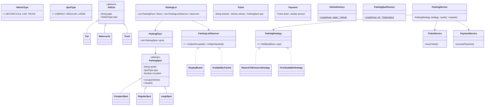

# 🅿️ Parking Lot System — Low Level Design

A complete parking lot system implementing **Strategy Pattern**, **Observer Pattern**, and **Factory Pattern** with multi-floor support, vehicle-type-based spot allocation, ticketing, and payment processing.

## Design Patterns Used

| Pattern | Purpose | Classes |
|---------|---------|---------|
| **Strategy** | Pluggable spot selection algorithm (Nearest-to-Entrance, First-Available) | `ParkingStrategy`, `NearestToEntranceStrategy`, `FirstAvailableStrategy` |
| **Observer** | Notify display boards and trackers when spots change | `ParkingLotObserver`, `DisplayBoard`, `AvailabilityTracker` |
| **Factory** | Create vehicles and parking spots from type enums | `VehicleFactory`, `ParkingSpotFactory` |

## 📂 Package Structure

```
ParkingLot/
├── model/           # Domain entities
│   ├── VehicleType.java       — MOTORCYCLE, CAR, TRUCK
│   ├── SpotType.java          — COMPACT, REGULAR, LARGE
│   ├── Vehicle.java           — Abstract base + plate, type
│   ├── Car.java, Motorcycle.java, Truck.java
│   ├── ParkingSpot.java       — Abstract base + occupy/vacate
│   ├── CompactSpot.java, RegularSpot.java, LargeSpot.java
│   ├── ParkingFloor.java      — Floor with list of spots
│   ├── ParkingLot.java        — Multi-floor lot + observers
│   ├── Ticket.java            — Entry ticket with timestamp
│   └── Payment.java           — Payment record
├── factory/         # Factory Pattern
│   ├── VehicleFactory.java    — Creates vehicles from type
│   └── ParkingSpotFactory.java — Creates spots from type
├── strategy/        # Strategy Pattern
│   ├── ParkingStrategy.java   — Interface
│   ├── NearestToEntranceStrategy.java
│   └── FirstAvailableStrategy.java
├── observer/        # Observer Pattern
│   ├── ParkingLotObserver.java — Interface
│   ├── DisplayBoard.java      — Shows spot availability
│   └── AvailabilityTracker.java — Tracks counts
├── service/         # Business logic
│   ├── TicketService.java     — Issue/validate tickets
│   ├── PaymentService.java    — Calculate fees
│   └── ParkingService.java    — Park/unpark orchestration
└── ParkingLotMain.java        — Demo scenarios
```

## 🔄 How Strategy Pattern Works

1. **`ParkingService`** holds a `ParkingStrategy` reference that can be swapped at runtime
2. When a vehicle arrives, `ParkingService` calls `strategy.findSpot(floors, vehicleType)`
3. **`NearestToEntranceStrategy`** picks the first available spot on the lowest floor
4. **`FirstAvailableStrategy`** scans all floors and returns any available matching spot
5. Strategy can be changed mid-operation without restarting the system

## 📐 UML Class Diagram



## 🚀 How to Run

```bash
cd /Users/srnitish/workplace/LLD2
javac -d out src/ParkingLot/model/*.java src/ParkingLot/factory/*.java src/ParkingLot/strategy/*.java src/ParkingLot/observer/*.java src/ParkingLot/service/*.java src/ParkingLot/ParkingLotMain.java
cd out && java ParkingLot.ParkingLotMain
```

## 📋 Demo Scenarios

1. **Park vehicles** — Car, Motorcycle, Truck parked using Nearest-to-Entrance strategy
2. **Strategy swap** — Switch to First-Available strategy at runtime
3. **Observer notifications** — Display board and tracker update on park/unpark
4. **Unpark & payment** — Vehicle exits, fee calculated, spot freed
5. **Full lot** — Attempt to park when no spots available
