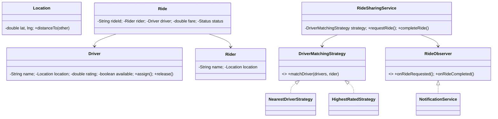

# 🚗 Ride-Sharing System (Uber) — Low Level Design

A complete ride-sharing system implementing **Strategy Pattern** and **Observer Pattern** with driver matching, ride lifecycle management, fare calculation, driver ratings, and real-time notifications.

## Design Patterns Used

| Pattern | Purpose | Classes |
|---------|---------|---------|
| **Strategy** | Pluggable driver matching algorithm (Nearest, Highest-rated) | `DriverMatchingStrategy`, `NearestDriverStrategy`, `HighestRatedStrategy` |
| **Observer** | Notify on ride request, pickup, and completion | `RideObserver`, `NotificationService` |

## 📂 Package Structure

```
RideSharing/
├── model/           # Domain entities
│   ├── Location.java          — Lat/lng coordinates with distance calculation
│   ├── Driver.java            — Name, location, rating, availability
│   ├── Rider.java             — Name, location
│   └── Ride.java              — Rider, driver, status, fare
├── strategy/        # Strategy Pattern
│   ├── DriverMatchingStrategy.java
│   ├── NearestDriverStrategy.java
│   └── HighestRatedStrategy.java
├── observer/        # Observer Pattern
│   ├── RideObserver.java
│   └── NotificationService.java
├── service/         # Business logic
│   └── RideSharingService.java — Request ride, pickup, complete, cancel, rate
└── RideSharingMain.java       — Demo scenarios
```

## 🔄 How Strategy Pattern Works

1. **`RideSharingService`** holds a `DriverMatchingStrategy` for selecting the best available driver
2. **`NearestDriverStrategy`** calculates distance from rider to each available driver, picks closest
3. **`HighestRatedStrategy`** sorts available drivers by rating descending, picks best-rated
4. Strategy is swappable at runtime via `setStrategy()`

## 📐 UML Class Diagram



## 🚀 How to Run

```bash
cd /Users/srnitish/workplace/LLD2
javac -d out src/RideSharing/model/*.java src/RideSharing/strategy/*.java src/RideSharing/observer/*.java src/RideSharing/service/*.java src/RideSharing/RideSharingMain.java
cd out && java RideSharing.RideSharingMain
```

## 📋 Demo Scenarios

1. **Request ride** — Nearest driver matched to rider
2. **Strategy swap** — Switch to highest-rated driver matching
3. **Complete ride** — Ride completed, fare calculated, driver rated
4. **Cancel ride** — Rider cancels, driver released
5. **All drivers busy** — No available drivers scenario
