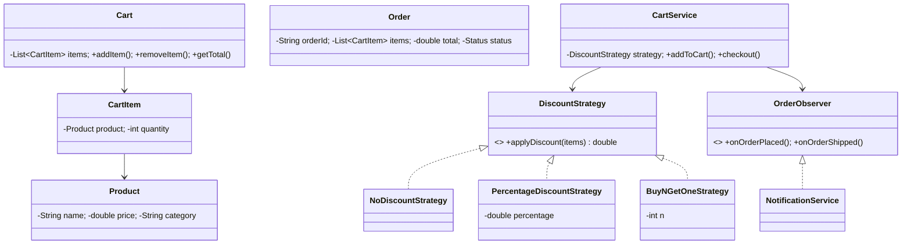

# 🛒 Shopping Cart System — Low Level Design

A complete e-commerce shopping cart implementing **Strategy Pattern**, **Observer Pattern**, and **Decorator Pattern** with product catalog, cart management, pluggable discount strategies, and order notifications.

## Design Patterns Used

| Pattern | Purpose | Classes |
|---------|---------|---------|
| **Strategy** | Pluggable discount calculation (No discount, Percentage, Buy-N-Get-1-Free) | `DiscountStrategy`, `NoDiscountStrategy`, `PercentageDiscountStrategy`, `BuyNGetOneStrategy` |
| **Observer** | Notify on order placement and status changes | `OrderObserver`, `NotificationService` |

## 📂 Package Structure

```
ShoppingCart/
├── model/           # Domain entities
│   ├── Product.java           — Name, price, category
│   ├── CartItem.java          — Product + quantity
│   ├── Cart.java              — List of cart items
│   └── Order.java             — Order with total, status
├── strategy/        # Strategy Pattern
│   ├── DiscountStrategy.java  — Interface
│   ├── NoDiscountStrategy.java
│   ├── PercentageDiscountStrategy.java
│   └── BuyNGetOneStrategy.java
├── observer/        # Observer Pattern
│   ├── OrderObserver.java     — Interface
│   └── NotificationService.java
├── service/         # Business logic
│   └── CartService.java       — Add/remove items, checkout with strategy
└── ShoppingCartMain.java      — Demo scenarios
```

## 🔄 How Strategy Pattern Works

1. **`CartService`** holds a `DiscountStrategy` reference that calculates the final price
2. **`NoDiscountStrategy`** returns the base total as-is
3. **`PercentageDiscountStrategy`** applies a configurable percentage off the total
4. **`BuyNGetOneStrategy`** gives the cheapest item free for every N items
5. Strategy can be swapped at runtime for different customer tiers (regular, premium, sale)

## 📐 UML Class Diagram



## 🚀 How to Run

```bash
cd /Users/srnitish/workplace/LLD2
javac -d out src/ShoppingCart/model/*.java src/ShoppingCart/strategy/*.java src/ShoppingCart/observer/*.java src/ShoppingCart/service/*.java src/ShoppingCart/ShoppingCartMain.java
cd out && java ShoppingCart.ShoppingCartMain
```

## 📋 Demo Scenarios

1. **Regular checkout** — Add items to cart, checkout with no discount
2. **Percentage discount** — Switch to 15% off strategy for premium members
3. **Buy-N-Get-1-Free** — Apply promotional strategy at runtime
4. **Empty cart** — Attempt checkout with empty cart
5. **Observer notifications** — Email/SMS on order placement
