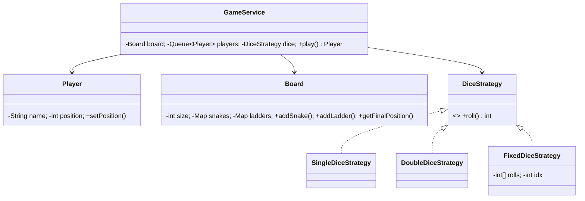

# 🐍🪜 Snake & Ladder — Low Level Design

A complete Snake & Ladder game implementing **Strategy Pattern** with pluggable dice strategies (Single, Double, Fixed/deterministic), configurable board with snakes and ladders, multi-player support, and turn-based gameplay.

## Design Patterns Used

| Pattern | Purpose | Classes |
|---------|---------|---------|
| **Strategy** | Pluggable dice rolling algorithm (Single die, Double dice, Fixed sequence) | `DiceStrategy`, `SingleDiceStrategy`, `DoubleDiceStrategy`, `FixedDiceStrategy` |

## 📂 Package Structure

```
SnakeLadder/
├── model/           # Domain entities
│   ├── Player.java            — Name, current position on board
│   └── Board.java             — Size, snakes map, ladders map, position resolution
├── strategy/        # Strategy Pattern
│   ├── DiceStrategy.java      — Interface: roll() returns int
│   ├── SingleDiceStrategy.java — Random 1-6
│   ├── DoubleDiceStrategy.java — Random 2-12 (two dice)
│   └── FixedDiceStrategy.java — Deterministic sequence for testing
├── service/         # Business logic
│   └── GameService.java       — Turn management, snake/ladder detection, win check
└── SnakeLadderMain.java       — Demo scenarios
```

## 🔄 How Strategy Pattern Works

1. **`GameService`** holds a `DiceStrategy` that determines each player's roll
2. **`SingleDiceStrategy`** rolls random 1-6 (standard single die)
3. **`DoubleDiceStrategy`** rolls two dice (2-12) for faster games
4. **`FixedDiceStrategy`** uses a predetermined sequence — perfect for **deterministic testing**
5. Board resolves snakes (slide down) and ladders (climb up) after each move

## 📐 UML Class Diagram



## 🚀 How to Run

```bash
cd /Users/srnitish/workplace/LLD2
javac -d out src/SnakeLadder/model/*.java src/SnakeLadder/strategy/*.java src/SnakeLadder/service/*.java src/SnakeLadder/SnakeLadderMain.java
cd out && java SnakeLadder.SnakeLadderMain
```

## 📋 Demo Scenarios

1. **Fixed dice game** — Deterministic 30-cell board with 2 players, predictable outcome
2. **Random dice game** — 100-cell board with 3 players, random single-die rolls
3. **Snake encounters** — Players land on snake heads, slide down
4. **Ladder encounters** — Players land on ladder bases, climb up
5. **Exceed board** — Roll that exceeds board size, player stays in place
