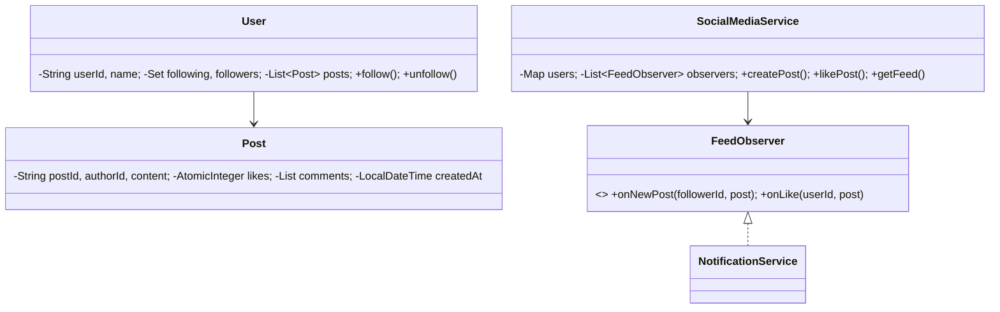

# 📱 Social Media System — Low Level Design

A complete social media platform implementing **Observer Pattern** with user profiles, follow/unfollow, posts with likes and comments, chronological feed generation, and real-time follower notifications.

## Design Patterns Used

| Pattern | Purpose | Classes |
|---------|---------|---------|
| **Observer** | Notify followers when a user creates a new post or receives a like | `FeedObserver`, `NotificationService` |

## 📂 Package Structure

```
SocialMedia/
├── model/           # Domain entities
│   ├── User.java              — UserId, name, following/followers sets, posts list
│   └── Post.java              — PostId, author, content, likes (AtomicInteger), comments, timestamp
├── observer/        # Observer Pattern
│   ├── FeedObserver.java      — Interface: onNewPost(), onLike()
│   └── NotificationService.java — Push notification logging
├── service/         # Business logic
│   └── SocialMediaService.java — Register, follow/unfollow, post, like, comment, getFeed
└── SocialMediaMain.java       — Demo scenarios
```

## 🔄 How Observer Pattern Works

1. **`SocialMediaService`** maintains a list of `FeedObserver` instances
2. When a user creates a post, the service iterates over the author's **followers set**
3. For each follower, all registered observers are notified with `onNewPost(followerId, post)`
4. On likes, observers are notified with `onLike(userId, post)`
5. Feed is generated by collecting posts from all followed users, sorted by timestamp descending

## 📐 UML Class Diagram



## 🚀 How to Run

```bash
cd /Users/srnitish/workplace/LLD2
javac -d out src/SocialMedia/model/*.java src/SocialMedia/observer/*.java src/SocialMedia/service/*.java src/SocialMedia/SocialMediaMain.java
cd out && java SocialMedia.SocialMediaMain
```

## 📋 Demo Scenarios

1. **Follow & Post** — Bob and Charlie follow Alice, both get notified on her post
2. **Like & Comment** — Multiple users like and comment, post stats update
3. **Feed generation** — Each user sees posts from people they follow, reverse-chronological
4. **Unfollow** — Bob unfollows Alice, no longer gets notifications or feed items
