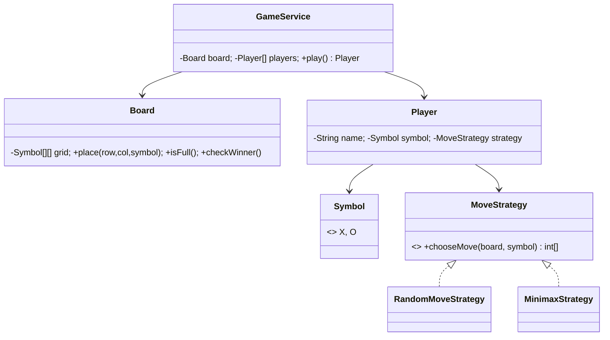

# ❌⭕ Tic-Tac-Toe — Low Level Design

A complete Tic-Tac-Toe game implementing **Strategy Pattern** with pluggable AI algorithms (Random, Minimax), a clean board model, win/draw detection, and support for Human vs Human, Human vs AI, and AI vs AI modes.

## Design Patterns Used

| Pattern | Purpose | Classes |
|---------|---------|---------|
| **Strategy** | Pluggable AI move selection (Random, Minimax — unbeatable) | `MoveStrategy`, `RandomMoveStrategy`, `MinimaxStrategy` |

## 📂 Package Structure

```
TicTacToe/
├── model/           # Domain entities
│   ├── Symbol.java            — X, O enum
│   ├── Board.java             — 3x3 grid, place/check/reset
│   └── Player.java            — Name, symbol, move strategy
├── strategy/        # Strategy Pattern
│   ├── MoveStrategy.java      — Interface: chooseMove(board, symbol)
│   ├── RandomMoveStrategy.java — Random empty cell selection
│   └── MinimaxStrategy.java   — Minimax algorithm (unbeatable AI)
├── service/         # Business logic
│   └── GameService.java       — Turn management, win/draw detection, game loop
└── TicTacToeMain.java         — Demo scenarios
```

## 🔄 How Strategy Pattern Works

1. Each `Player` holds a `MoveStrategy` that determines how they pick their next move
2. **`RandomMoveStrategy`** picks a random empty cell — simple but beatable
3. **`MinimaxStrategy`** evaluates all possible future states recursively — **unbeatable AI**
4. Human players use `null` strategy (manual input in real app; auto-random in demo)
5. Strategy is set per-player, enabling mixed modes (Human vs Minimax AI)

## 📐 UML Class Diagram



## 🚀 How to Run

```bash
cd /Users/srnitish/workplace/LLD2
javac -d out src/TicTacToe/model/*.java src/TicTacToe/strategy/*.java src/TicTacToe/service/*.java src/TicTacToe/TicTacToeMain.java
cd out && java TicTacToe.TicTacToeMain
```

## 📋 Demo Scenarios

1. **Random vs Random** — Two random AIs play, demonstrates turn management and win detection
2. **Minimax vs Random** — Unbeatable AI always wins or draws against random
3. **Minimax vs Minimax** — Two perfect AIs always draw
