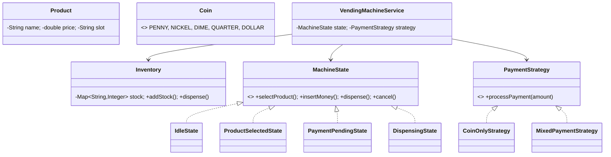

# 🥤 Vending Machine System — Low Level Design

A complete vending machine implementing **State Pattern** and **Strategy Pattern** with product inventory, coin/note payment processing, state machine for transaction flow, and change calculation.

## Design Patterns Used

| Pattern | Purpose | Classes |
|---------|---------|---------|
| **State** | Machine state transitions (Idle → ProductSelected → PaymentPending → Dispensing) | `MachineState`, `IdleState`, `ProductSelectedState`, `PaymentPendingState`, `DispensingState` |
| **Strategy** | Pluggable payment processing (Coin-only, Mixed payment) | `PaymentStrategy`, `CoinOnlyStrategy`, `MixedPaymentStrategy` |

## 📂 Package Structure

```
VendingMachine/
├── model/           # Domain entities
│   ├── Product.java           — Name, price, slot
│   ├── Inventory.java         — Product stock management
│   ├── Coin.java              — Coin denominations enum
│   └── Payment.java           — Payment tracking
├── state/           # State Pattern
│   ├── MachineState.java      — Interface
│   ├── IdleState.java         — Waiting for selection
│   ├── ProductSelectedState.java — Product chosen, awaiting payment
│   ├── PaymentPendingState.java — Accepting money
│   └── DispensingState.java   — Dispensing product + change
├── strategy/        # Strategy Pattern
│   ├── PaymentStrategy.java
│   ├── CoinOnlyStrategy.java
│   └── MixedPaymentStrategy.java
├── service/         # Business logic
│   └── VendingMachineService.java — Select, pay, dispense, cancel
└── VendingMachineMain.java    — Demo scenarios
```

## 🔄 How State Pattern Works

1. Machine starts in **`IdleState`** — only `selectProduct()` is valid
2. Product selected → **`ProductSelectedState`** — can insert money or cancel
3. Money inserted → **`PaymentPendingState`** — accumulate until price met
4. Price met → **`DispensingState`** — dispenses product, returns change, back to Idle
5. Cancel at any point → refunds inserted money, returns to Idle

## 📐 UML Class Diagram



## 🚀 How to Run

```bash
cd /Users/srnitish/workplace/LLD2
javac -d out src/VendingMachine/model/*.java src/VendingMachine/state/*.java src/VendingMachine/strategy/*.java src/VendingMachine/service/*.java src/VendingMachine/VendingMachineMain.java
cd out && java VendingMachine.VendingMachineMain
```

## 📋 Demo Scenarios

1. **Full purchase** — Select → Pay → Dispense with correct change
2. **Overpayment** — Insert more than needed, receive change
3. **Cancel mid-transaction** — Cancel after selection, get refund
4. **Out of stock** — Attempt to buy sold-out product
5. **Insufficient payment** — Partial payment handling
